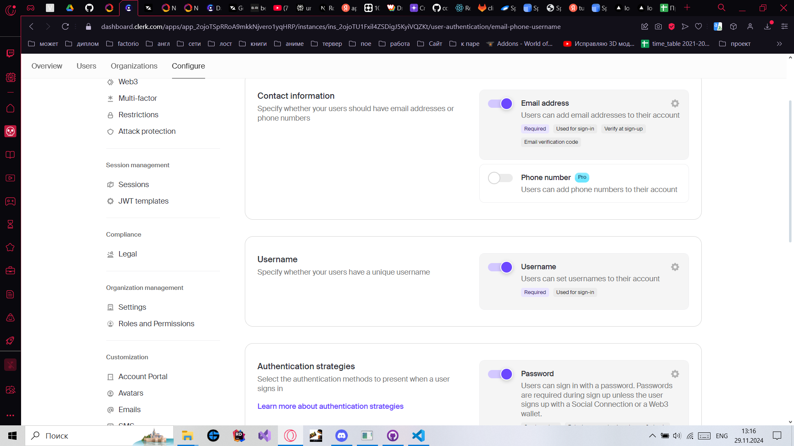
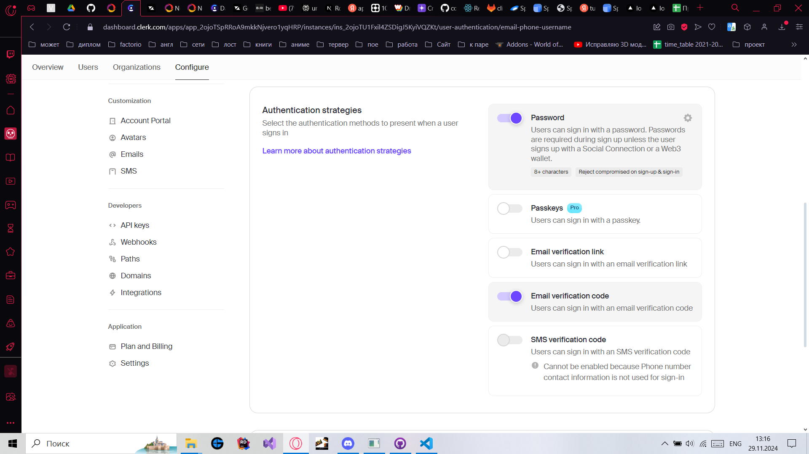
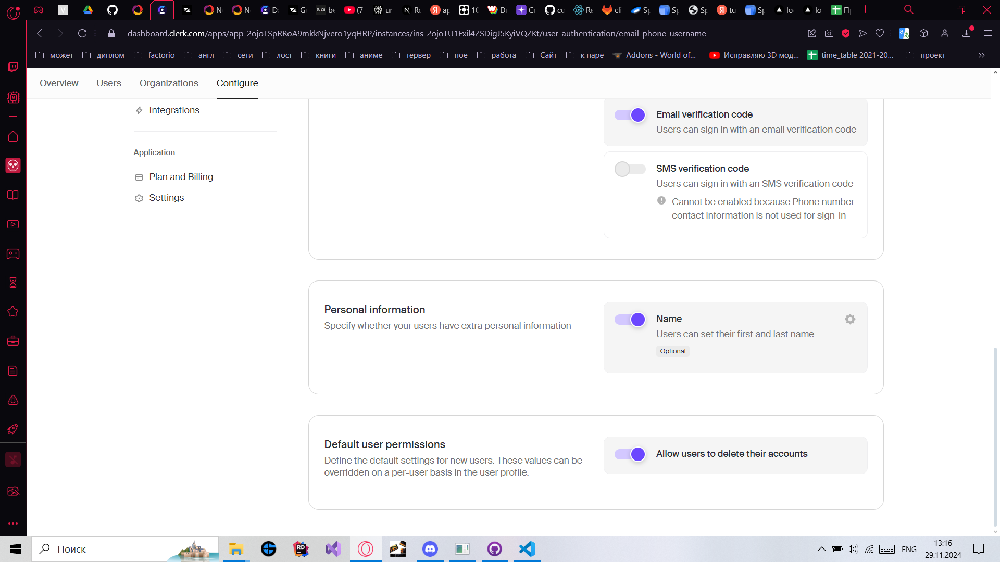
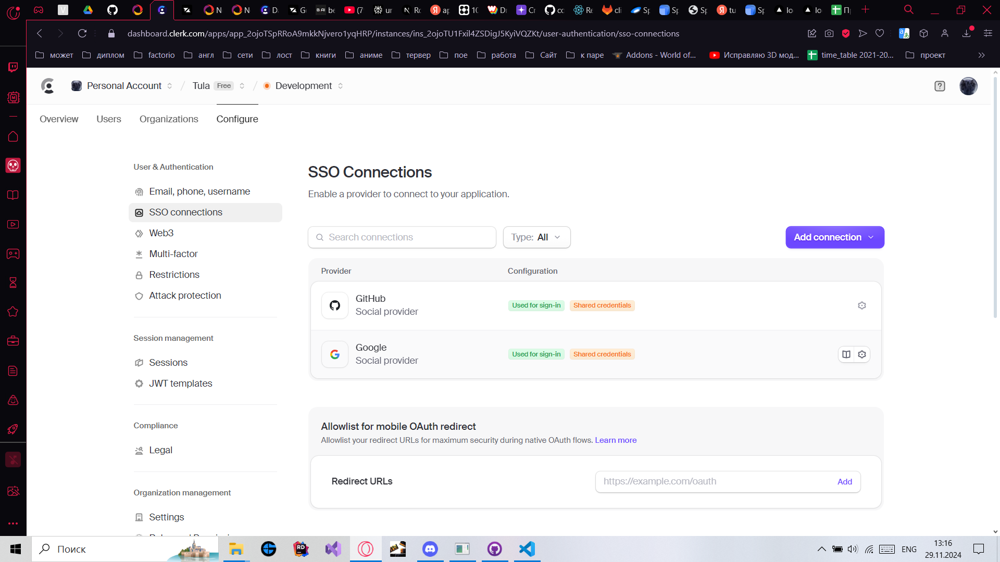
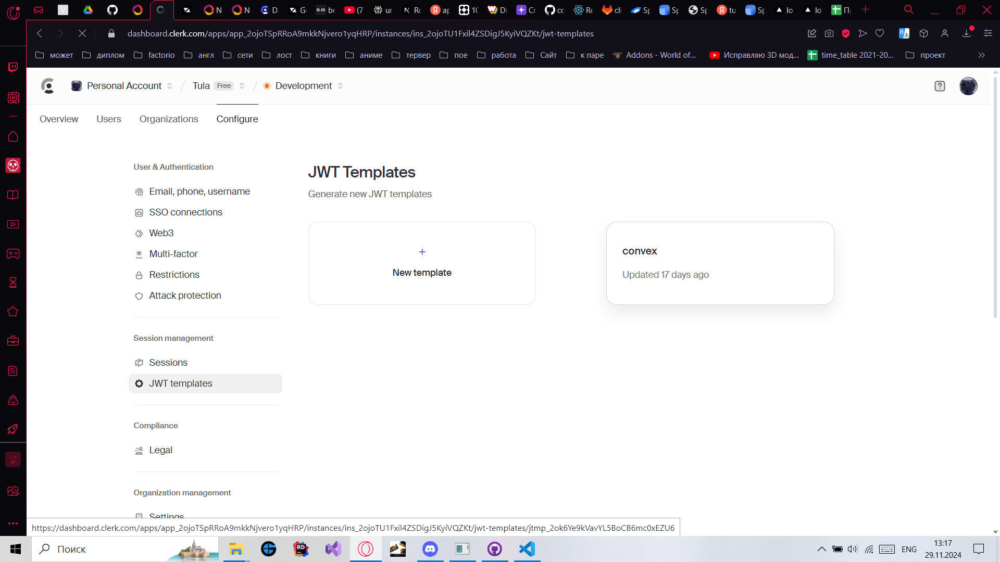
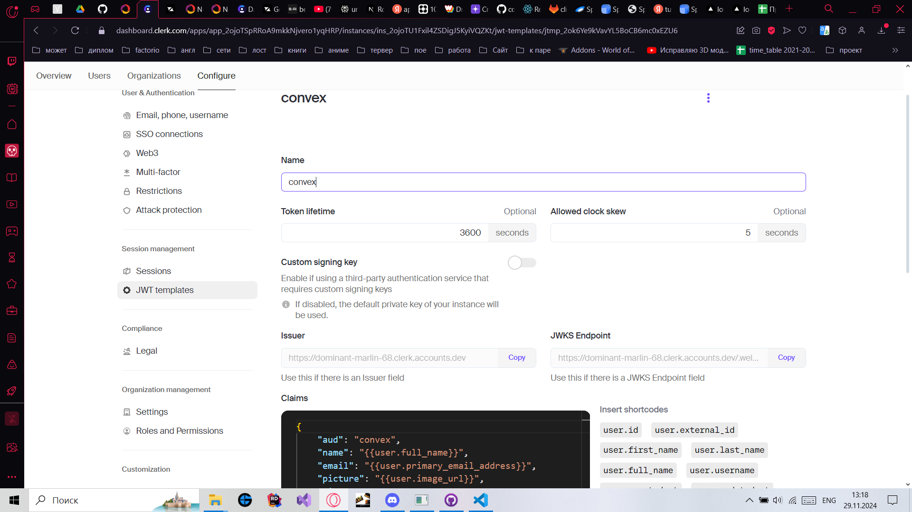
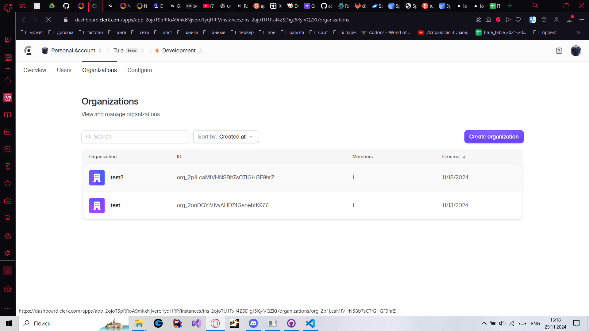
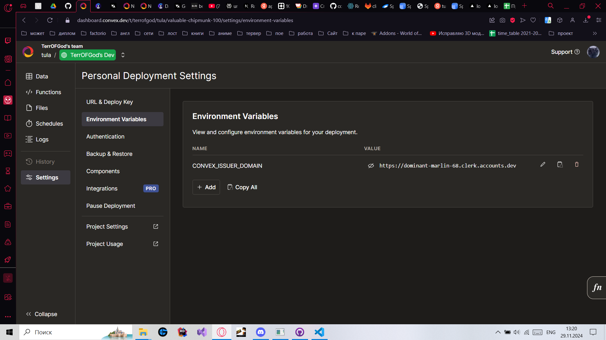
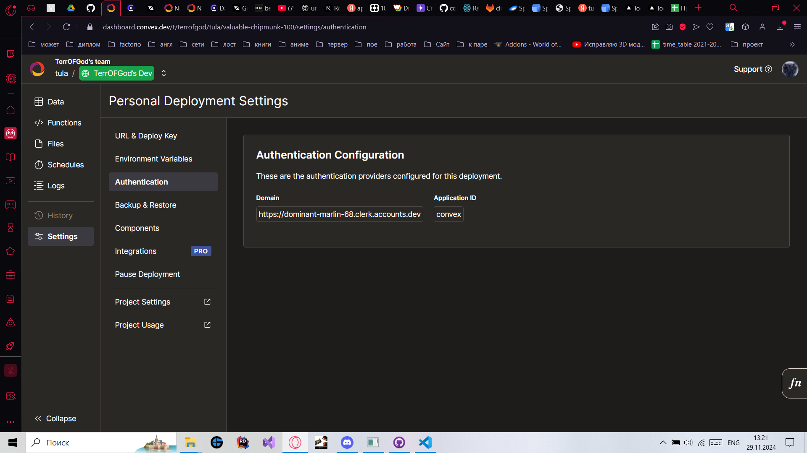

# Правила запуска
Для студентов отдельные ветки. 
Принцип следующие: есть ветвь students, от нее студент создает ветвь
Сервер в основном не связан с клиентом, его можно не запускать, ничего не изменится
## Запуск клиент
Для начала создаете аккаунты в Clerk, Convex, Liveblocks с проектами Tula
Настройки Clerk - обязательно создайте jwt для convex и активируйте организации:
Настройка Convex - в переменные окружения, входа обязательно введите ссылку на clerk jwt: 
Из Liveblocks нам нужны ключи api
Все ключи Api меняем в файле .env.local, так же поменяйте ссылку в файле auth.config.ts
Сначала запускайте convex, затем клиент 
nextJs - npm run dev
convex - npx convex dev

